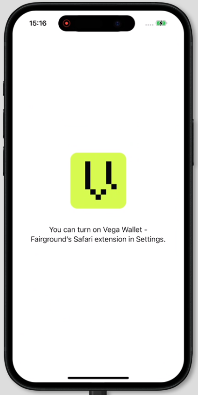
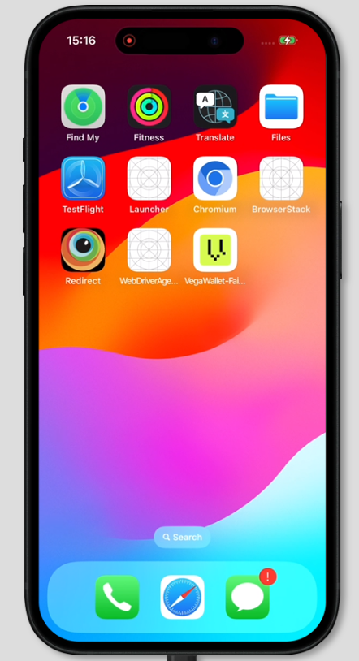
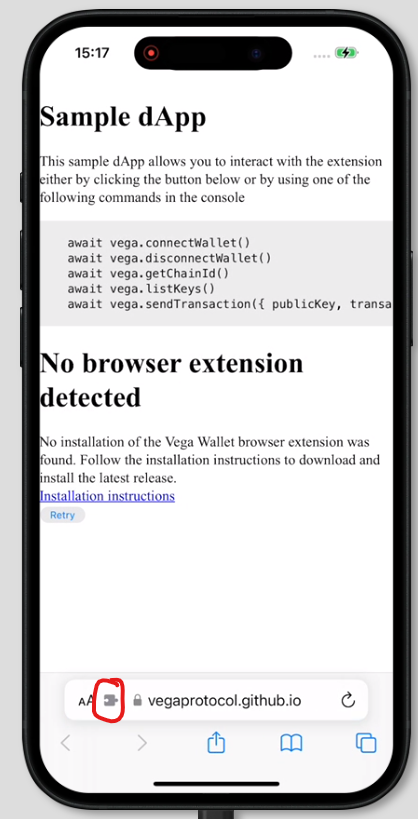
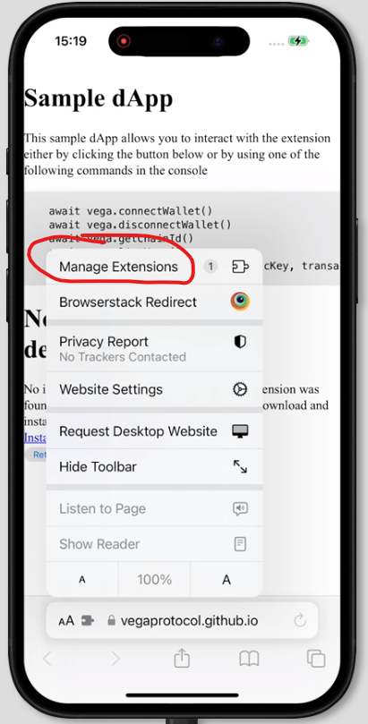
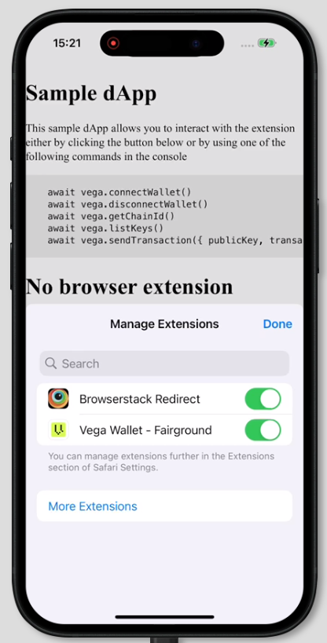
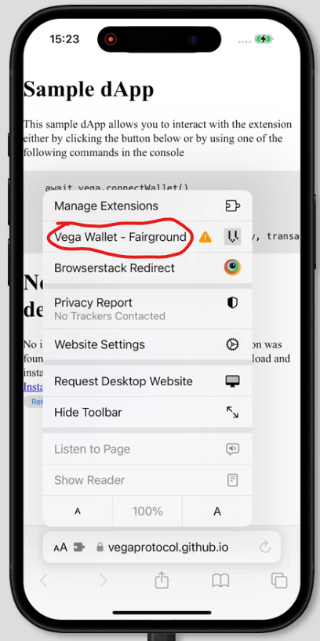
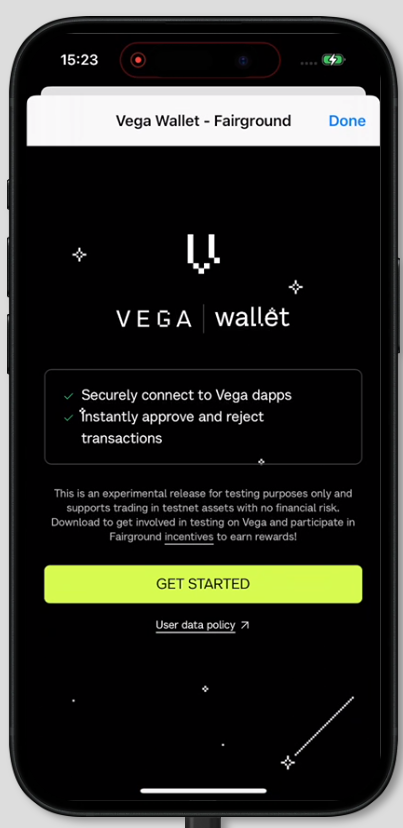
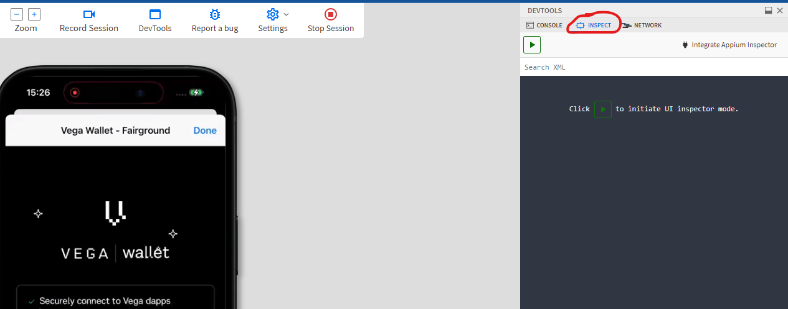
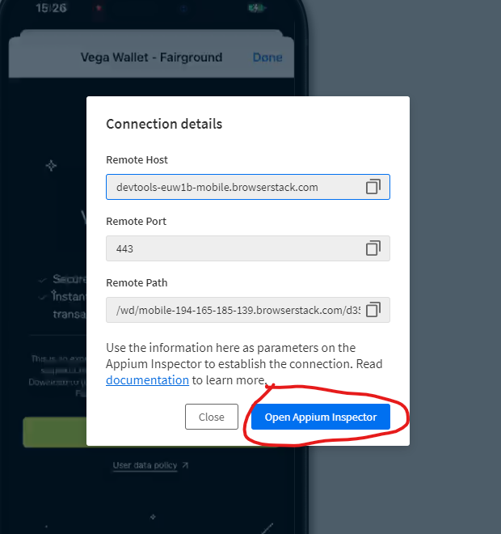

**This is a draft and should be refined before merging**
# Mobile Tests

## What do we test here?
The objective of these tests is to assess the essential functionalities of the browser wallet specifically tailored for mobile, focusing primarily on iOS (this should later be expanded to cover Android). We target functionalities with the highest risk. It's crucial to emphasize that this testing phase should be a blanket duplication of the test coverage already present in our browser-based [E2E tests](../e2e/).  
At present, the proof of concept (POC) encompasses onboarding, connections, and executing a transaction via the wallet. The rationale behind focusing on these aspects is their critical importance and high value. Additionally, this limited scope should be enough to verify communication between a Safari page and browser wallet on a mobile device.

## Environment set up
To run locally, you will need to add your own browser stack credentials (`BROWSERSTACK_USERNAME`, `BROWSERSTACK_ACCESS_KEY`) to the [test.conf.cjs](test.conf.cjs)

## Creating tests for mobile
For the best experience, you will need to use the [Browserstack devices](https://www.browserstack.com/docs/app-live/get-started/launch-session). Follow the instructions to install Browser Wallet onto a device. 

### iOS specific set up
Once the app is loaded onto the device, you will see the vega wallet app displayed     
    

Navigate back to the home screen
    

Open safari and navigate to a webpage, (you could use our test dapp https://vegaprotocol.github.io/vegawallet-browser/), then click the extensions button located in the address bar (circled below)
      

Click 'Manage Extensions'
  

Toggle Vega Wallet to be enabled and then click Done
    

Click the 'Vega Wallet' extension to open, allow any permissions that the iPhone requests.
   

The wallet should open

### Locating Elements
You should use appium inspector for this. Open it by clicking the buttons circled below

You could also integrate it with a desktop instance of the inspector, however using Browserstack's inspector is likely the simplest option.   

The inspector is used to locate elements. You should still use the app via the 'App Live' device, you will need to refresh the state of the inspector to get the updated view of the app. Read more about the [Appium inspector](https://github.com/appium/appium-inspector)

### Running the tests 
You can run the tests by getting a mobile build. Currently this will need to be provided by dev. However in future we should be able to build locally via a new `yarn build:mobile:ios` command (or similar). For now, you will need to have the app uploaded to browserstack. You should provide the url the [test.conf.cjs](test.conf.cjs) (e.g `app: "bs://a25c4dc3e4c2ae24d67f8b47646044f281bbac23"`). You can get the url by selecting your app in this capability config generator [here](https://www.browserstack.com/app-automate/capabilities?tag=w3c)

When you have done the above you can run
`yarn test:ios`

The output of the test run should provide a link to the test results.

## Suggestions for the future
1. I think we should look to generate the builds via yarn commands 
2. We should upload the builds prior to a CI test run to browserstack and retrieve the url, instructions on how to do this are [here](https://www.browserstack.com/docs/app-automate/api-reference/appium/apps#upload-an-app), this should probably be a .sh script. 
3. Use accessibility IDs over XPaths. Dev/Test should look at how these are created and make them consistent with data-testids so the locators can be shared between frameworks.